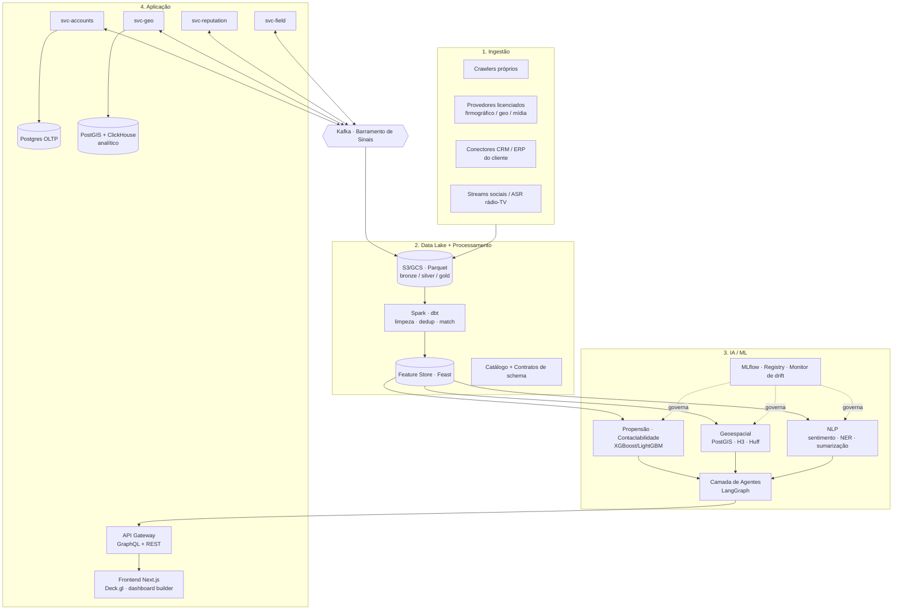
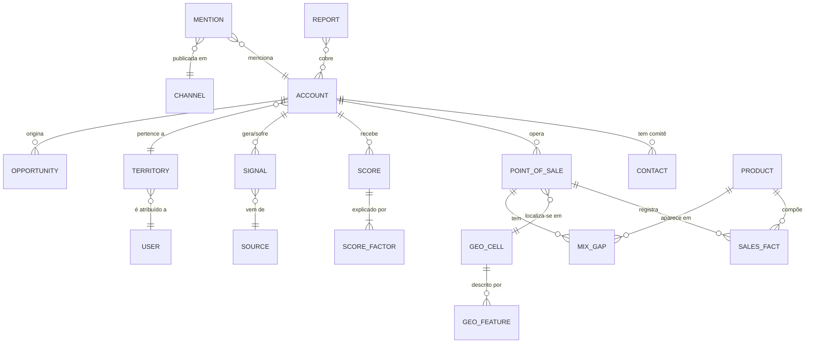
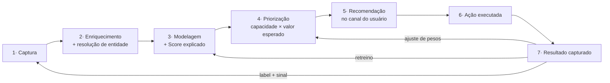

# Plataforma de Go-to-Market Intelligence — Especificação de Produto e Arquitetura

> Documento de arquitetura e produto para uma plataforma SaaS B2B que une big data,
> geointeligência e IA aplicada a decisões comerciais. Paridade funcional com a
> Cortex Intelligence (Growth, Geofusion, Brand, Reach) + diferenciais competitivos.
>
> **Nota de contexto:** este repositório (Vendalytics) já contém o núcleo do Módulo 1
> (Sales Intelligence) — multi-tenant via `config/tenant_config.yaml`, camada de dados
> plugável (`DataSourceAdapter`), módulos de métricas/mix/recompra e canal WhatsApp.
> A Fase 0 do roadmap (§6) parte daí, não do zero.

---

## 1. Visão de produto e posicionamento

### 1.1 Proposta de valor central

> **Transformar dados dispersos — públicos e proprietários — em decisões de crescimento
> acionáveis, do planejamento estratégico à execução em campo, sem exigir conhecimento
> técnico do usuário final.**

O produto não vende "dados" nem "dashboards". Vende **próxima ação priorizada com
justificativa**. A unidade de entrega não é um relatório: é uma recomendação nominal
("procure esta conta, com este argumento, por este canal, hoje") acompanhada dos fatores
que a geraram e de um mecanismo de captura do resultado.

### 1.2 Público-alvo

| Segmento | Dor primária | Módulo âncora |
|---|---|---|
| Times de vendas B2B (indústria, distribuição, serviços) | Não sabem quais contas do mercado total valem esforço | Sales Intelligence |
| Expansão de redes físicas (varejo, franquias, saúde, food) | Decisão de ponto por intuição/planilha; canibalização não medida | Geo Intelligence |
| Marketing e comunicação corporativa | Reputação medida por clipping manual; crise detectada tarde | Reputation Intelligence |
| Vendas de campo / trade / distribuição capilarizada | Vendedor não sabe qual SKU falta em qual PDV | Field Execution |

**Perfil de conta:** empresas de médio a grande porte (R$ 100M+ de receita ou 30+ vendedores
em campo) na América Latina, com dado transacional próprio e operação comercial já estruturada
o bastante para ter histórico de conversão — pré-requisito para os modelos preditivos.

### 1.3 Posicionamento competitivo

Contra a Cortex (e equivalentes: Serasa Experian, Neoway, Geofusion isolada):

| Eixo | Incumbente | Nossa aposta |
|---|---|---|
| Integração entre módulos | Produtos vendidos juntos, integrados de forma rasa | **Barramento único de sinais** — evento de reputação altera score de propensão em minutos |
| Transparência do modelo | Score é caixa-preta ("confie no algoritmo") | **Explicabilidade obrigatória** — todo score expõe os top-N fatores contributivos |
| Autonomia do usuário | Dashboards fixos, mudança via consultoria | **Citizen data science** — construtor de análise no-code + agente em linguagem natural |
| Comercial | Pacote fechado, contrato anual alto | **Modular por módulo + consumo**, entrada baixa, expansão por adoção |
| Time-to-value | Meses de onboarding/consultoria | **< 30 dias** para primeiro score em produção (adapter de dados + seed sintético para POC) |

### 1.4 Princípios de produto (não negociáveis)

1. **Toda recomendação é explicável.** Sem "fator: modelo v3". Fatores em linguagem de negócio.
2. **Toda recomendação é fechável.** Existe um caminho de 1 clique para "aceitei / recusei / venci / perdi", e esse dado volta para o treino.
3. **O usuário final nunca escreve SQL.** Linguagem natural e no-code são a interface primária; SQL é escape hatch para o analista.
4. **A ação acontece onde o usuário já trabalha.** CRM, WhatsApp, Slack, e-mail — não em mais uma aba aberta.
5. **Dado pessoal só entra com base legal.** Compliance LGPD/GDPR é requisito de arquitetura, não de jurídico.

---

## 2. Módulos de produto

### 2.1 Módulo A — **Sales Intelligence** (paridade: Cortex Growth)

**Objetivo:** responder "quem no mercado total eu deveria estar atacando, em que ordem, e por quem".

#### Capacidades

**A1. Definição de ICP por modelo preditivo**
- Ingestão do histórico de conversão do cliente (CRM: ganhos, perdas, motivos, ciclo, ticket).
- Treino de classificador supervisionado (ganho vs. perda) sobre features firmográficas,
  comportamentais e geográficas.
- Saída: **perfil ICP descritivo** (faixas de porte, CNAE, região, maturidade digital) +
  **modelo de scoring** aplicável a todo o TAM. O ICP é derivado, não declarado em workshop.
- Suporte a **múltiplos ICPs por cliente** (ex.: ICP de novo logo vs. ICP de cross-sell).

**A2. Mapeamento do mercado total endereçável (TAM/SAM/SOM)**
- Base firmográfica nacional (empresas ativas, CNAE, porte, capital social, sócios, filiais,
  data de abertura, situação cadastral) enriquecida com sinais digitais (site, tecnologias,
  vagas abertas, presença em marketplaces) e geográficos.
- Visualização: TAM → SAM (filtro de ICP) → SOM (filtro de capacidade comercial) com
  contagem, receita potencial estimada e **cobertura atual** (quanto do SAM já está no CRM).
- Detecção de *white space*: contas no SAM sem nenhum registro no CRM.

**A3. Scoring dinâmico**
Dois scores independentes, sempre exibidos juntos:
- **Propensão (0–100):** probabilidade calibrada de fechar em N dias. Modelo de gradient boosting.
- **Contactabilidade (0–100):** probabilidade de conseguir falar com um decisor —
  função da disponibilidade/frescor de telefone, e-mail corporativo válido, perfil social
  ativo, histórico de resposta do segmento. Um lead de alta propensão e baixa contactabilidade
  é um lead caro; o produto precisa dizer isso explicitamente.
- **Recomputação incremental:** disparada por evento no barramento (§3.6), não por batch noturno apenas.

**A4. Distribuição automática de territórios e contas**
- Otimização de carteiras sob restrições: equilíbrio de potencial por vendedor, distância/tempo
  de deslocamento, especialização por vertical, continuidade de relacionamento (não trocar
  conta ativa de dono sem motivo).
- Formulação: problema de particionamento com função objetivo multi-critério; heurística
  (simulated annealing / OR-Tools) — não exige ótimo global, exige explicável e ajustável à mão.
- **Simulação antes de aplicar:** "se eu contratar 3 vendedores, como fica a carteira?"

**A5. Enriquecimento de comitê de compras**
- Modelagem explícita de **múltiplos decisores por conta**, com papel (decisor econômico,
  usuário, influenciador, gatekeeper, campeão), senioridade e canal preferencial.
- Fontes: bases de contatos licenciadas, LinkedIn público (respeitando ToS), site institucional,
  imprensa, publicações oficiais (DOU, juntas comerciais para quadro societário).
- **Score de completude do comitê** — venda complexa com um único contato mapeado é risco.

**A6. Integrações bidirecionais**
- **CRMs:** Salesforce, HubSpot, Pipedrive, RD Station, Zoho. Sincronização bidirecional:
  *in* → histórico de oportunidades para treino; *out* → contas, scores, fatores explicativos
  e recomendações gravados em campos customizados.
- **Outreach:** Outreach.io, Salesloft, Reply, Apollo, além de e-mail (SMTP/OAuth) e WhatsApp Business API.
- Padrão de integração: conector com *mapeamento de campos configurável por tenant*,
  reconciliação por chave natural (CNPJ) + fuzzy match de razão social, e **idempotência**
  (nada de duplicar conta a cada sync).

**A7. Agente orquestrador**
Fecha o ciclo `planejar → priorizar → executar → medir → re-aprender`:
- Planejar: dado a meta trimestral e a capacidade do time, define quantas contas de cada faixa atacar.
- Priorizar: ordena a fila diária de cada vendedor.
- Executar: redige a abordagem personalizada (contexto da conta + sinais recentes + caso de sucesso similar).
- Medir: lê o resultado do CRM.
- Re-aprender: alimenta o retreino e ajusta pesos de priorização.

#### Métricas do módulo
Lead-to-opportunity rate, AUC/lift do modelo de propensão, cobertura do SAM, taxa de aceite
das recomendações pelo vendedor, ciclo médio de vendas.

---

### 2.2 Módulo B — **Geo Intelligence** (paridade: Geofusion)

**Objetivo:** responder "onde abrir, onde fechar, onde investir mídia, e quanto isso vai faturar".

#### Capacidades

**B1. Simulador de novos pontos com score de atratividade multivariável**
- Usuário marca um ponto no mapa (ou desenha um polígono candidato) e recebe:
  - **Score de atratividade (0–100)** decomposto em: demanda potencial, poder de compra,
    fluxo/acessibilidade, pressão competitiva, custo estimado de ocupação, canibalização das
    próprias unidades.
  - **Isócronas reais** (5/10/15/20 min a pé, carro, transporte público) e não círculos de raio —
    diferença material em cidades com barreira geográfica (rio, rodovia, morro).
  - **População capturável ponderada** por modelo de decaimento de distância (Huff), não soma bruta.
- Comparação lado a lado de até N candidatos com ranking e sensibilidade ("se o aluguel cair 15%, muda a ordem?").

**B2. Comparador de similaridade entre unidades existentes**
- Vetor de características de entorno por unidade (sociodemografia, concorrência, mobilidade,
  uso do solo) indexado em **H3** (hexágonos, resolução 8–9).
- Similaridade por distância cosseno/Mahalanobis no espaço de features → clusters de lojas-gêmeas.
- Uso prático: transferir aprendizado de precificação, sortimento e mídia entre lojas do mesmo cluster;
  e detectar **unidades com performance abaixo do que o entorno permitiria** (gap de execução vs. gap de praça).

**B3. Preditor de faturamento por localização**
- Modelo treinado no histórico de faturamento das unidades **do próprio cliente** (transfer
  learning por vertical quando o cliente tem poucas unidades).
- Saída: faturamento esperado com **intervalo de confiança** — nunca ponto único. Uma previsão
  de "R$ 480k ± 190k" é honesta e útil; "R$ 483.271" é falsa precisão.
- Backtesting obrigatório e visível: acurácia do modelo nas unidades existentes exibida ao lado da previsão.

**B4. Camadas de dados**
- **Sociodemográficas:** Censo IBGE (setor censitário), projeções anuais, renda domiciliar,
  estrutura etária, escolaridade, densidade, domicílios.
- **Comportamentais:** POS/cartão agregado, telemetria de mobilidade anonimizada e agregada,
  pesquisas de consumo (POF).
- **Concorrência:** POIs (Google Places, OSM, bases próprias), com classificação por bandeira e formato.
- **Infraestrutura:** malha viária, transporte público, polos geradores de tráfego (escolas,
  hospitais, shoppings, terminais).

**B5. Módulos verticais plugáveis**
Arquitetura de *vertical packs* — cada um é um conjunto de camadas + features + modelo calibrado:
`shopping centers` (mix de lojas, fluxo, ABL), `mídia externa` (inventário OOH, impacto por
face, alcance/frequência), `condomínios` (lançamentos, VGV, entrega prevista), `saúde`
(demanda por especialidade, sinistralidade regional), `food service`, `agro`.

#### Métricas do módulo
Erro percentual absoluto médio (MAPE) do preditor de faturamento em unidades novas,
taxa de acerto do ranking de candidatos (o #1 recomendado performou no top quartil?),
número de simulações por usuário/mês.

---

### 2.3 Módulo C — **Reputation / Brand Intelligence** (paridade: Cortex Brand)

**Objetivo:** responder "o que estão dizendo, isso importa para o negócio, e o que faço agora".

#### Capacidades

**C1. Monitoramento multi-canal**
- **Imprensa:** portais nacionais/regionais, agregadores, mídia especializada por vertical.
- **Redes sociais:** X, Instagram, Facebook, TikTok, YouTube, LinkedIn, Reddit, fóruns.
- **Rádio e TV:** captação de áudio/vídeo + **ASR (speech-to-text)** e indexação do transcrito —
  é aqui que a maior parte dos concorrentes de nicho falha.
- **Canais de reclamação:** Reclame Aqui, Procon, app stores, Google Reviews.
- Deduplicação de matéria replicada (uma nota de agência em 40 portais é **um** evento com 40 veículos,
  não 40 eventos) via *near-duplicate detection* (MinHash/SimHash).

**C2. Classificação por NLP**
- **Sentimento** em 3 níveis (documento, sentença, aspecto) — polaridade agregada esconde
  "produto ótimo, atendimento péssimo".
- **Entidades e aspectos:** marca, produto, executivos, concorrentes, temas (preço, ESG, trabalhista, qualidade).
- **Relevância ponderada:** alcance do veículo × posição × engajamento × autoridade do autor.
  Um tweet de 12 seguidores e uma capa de jornal não são o mesmo evento.
- **Risco:** classificador de potencial de escalada (crise) treinado em séries históricas de crises reais.

**C3. Tradução de objetivo de negócio em KPI de comunicação**
Assistente que mapeia meta ("reduzir churn em 2pp") para KPIs de comunicação rastreáveis
(share of voice em temas de atendimento, sentimento em aspecto "suporte", tempo de resposta
público) — e mede a correlação real desses KPIs com o resultado de negócio ao longo do tempo,
descartando os que não correlacionam.

**C4. Relatórios executivos automatizados**
Geração em linguagem natural (LLM sobre dados agregados, **nunca sobre alucinação**: cada
afirmação do relatório carrega link para os eventos-fonte). Cadência configurável, formato
apresentável (PDF/deck), com seção fixa "o que mudou desde o último relatório".

**C5. Alertas em tempo real**
Regras (volume, sentimento, entidade, veículo) + **detecção de anomalia** (desvio do baseline
sazonal do próprio cliente). Entrega: WhatsApp, Slack, Teams, e-mail, webhook. Com **supressão de
ruído** — política de agrupamento e cooldown, porque alerta que dispara 40x/dia é alerta desligado.

**C6. Benchmarking competitivo**
Share of voice, sentimento comparado, timeline de eventos por concorrente, e detecção de
"eles falaram de um tema antes de nós" (liderança temática).

#### Métricas do módulo
Tempo médio de detecção de crise (TTD), precisão/recall do classificador de sentimento vs.
amostra rotulada por humano, taxa de alerta acionável (alertas que geraram ação / total).

---

### 2.4 Módulo D — **Field Execution** (paridade: Cortex Reach)

**Objetivo:** responder, para o vendedor de campo, "o que vender, para quem, hoje".

#### Capacidades

**D1. Potencial inexplorado no nível PDV × SKU**
- Para cada par (ponto de venda, SKU/categoria): **potencial estimado** (a partir de PDVs
  similares — mesmo cluster geo/comportamental — que compram aquele SKU) menos **realizado**
  = **gap de mix**.
- Priorização do gap por margem × probabilidade de aceite × esforço.
- É a fusão natural de Geo (similaridade de entorno) com Sales (propensão) — e o argumento
  mais forte do barramento unificado.

**D2. Agente conversacional no canal do vendedor**
- WhatsApp (Business API) e app mobile. O vendedor pergunta em linguagem natural
  ("o que levo pro Mercado São Jorge?") e recebe: 3 sugestões, motivo de cada uma, e histórico curto.
- Push proativo: roteiro do dia às 7h, com sequência otimizada por rota.
- **Captura de campo em loop fechado:** o vendedor responde "não tem espaço em gôndola" /
  "concorrente entrou com preço X" / "comprou 20un" — e isso vira dado estruturado
  (evento no barramento) que corrige o modelo e alimenta o módulo de reputação e o de geo.

**D3. Validação de dado de campo**
Divergências entre base e realidade (PDV fechado, endereço errado, bandeira trocada) são
capturadas pelo vendedor e entram numa fila de curadoria com reputação de informante —
o dado de campo é a única correção confiável para bases públicas defasadas.

#### Métricas do módulo
Cobertura de visita, taxa de conversão da recomendação em pedido, incremento de itens por
pedido (mix), tempo de resposta do agente, taxa de resposta do vendedor ao loop de captura.

---

### 2.5 Diferenciais competitivos (transversais)

#### D-1. Barramento único de sinais
Todo módulo **publica** e **consome** eventos numa espinha dorsal comum (Kafka, §3.6).
Exemplos de fechamento de ciclo impossíveis em produtos separados:

| Sinal capturado em… | Consumido por… | Efeito |
|---|---|---|
| Reputação: crise trabalhista em conta-alvo | Sales | Propensão cai; recomendação de pausar outreach por 30 dias |
| Reputação: concorrente com sentimento em queda no aspecto "entrega" | Sales / Field | Argumento de abordagem gerado automaticamente para contas daquele concorrente |
| Geo: novo concorrente abriu a 400m de uma unidade | Field / Sales | Alerta de defesa de praça; reprecificação sugerida |
| Field: vendedor reporta PDV fechado | Geo / Sales | Base corrigida; TAM recalculado; conta removida da fila |
| Sales: perda por preço em 3 contas do mesmo cluster | Geo / Pricing | Sinaliza problema de competitividade regional, não de vendedor |

#### D-2. Explicabilidade obrigatória
- Todo `Score` persistido carrega um vetor de **contribuições SHAP** dos top-N features,
  traduzidas para linguagem de negócio por um dicionário de features versionado.
- UI: "Propensão 87 — porque: cresceu 3 filiais em 18 meses (+18), CNAE idêntico aos seus
  5 maiores clientes (+15), abriu 4 vagas de TI (+9), mas: sem contato de nível diretor mapeado (−7)."
- **Contrafactual:** "o que precisaria mudar para este score subir?" — orienta ação, não só explica.
- Regra de arquitetura: **um score sem explicação não pode ser gravado.** O schema não permite null.

#### D-3. Citizen data science
- Construtor de análise no-code: seleção de entidade → filtros → agregações → visualização,
  sobre um **modelo semântico** (métricas definidas uma vez, centralmente — não cada usuário
  reinventando "receita líquida").
- **Consulta em linguagem natural** → NL2SQL restrito ao modelo semântico (não SQL livre no
  banco: reduz superfície de erro e de vazamento entre tenants), com o SQL gerado sempre visível.
- Análises viram objetos compartilháveis, versionados e agendáveis.

#### D-4. Comercial modular
- Preço por **módulo ativado** × **volume da dimensão relevante** (contas monitoradas, unidades
  simuladas, menções processadas, PDVs ativos) + assentos.
- Entrada por um módulo, expansão por adoção. Sem contrato all-in obrigatório —
  ataca diretamente a principal objeção ao incumbente.

---

## 3. Arquitetura técnica



### 3.1 Camada de ingestão

**Fontes**
1. **Crawlers próprios** — portais de notícia, sites institucionais, marketplaces, POIs, editais,
   diários oficiais. Framework: Scrapy/Playwright em pool de workers, com:
   - Rotação de IP/user-agent **dentro do que os ToS permitem** — respeito a `robots.txt` é regra
     de código, não de política: um middleware bloqueia a requisição, não um documento pede que não se faça.
   - Rate limiting por domínio, backoff exponencial, cache de conteúdo por hash.
   - **Registro de proveniência obrigatório** por documento: URL, timestamp, robots checado,
     base legal da coleta. Sem proveniência, o registro não entra no lake.
2. **Provedores licenciados** — firmográficos (Serasa, Neoway, Receita/CNPJ público), geográficos
   (IBGE, HERE/Google, mobilidade agregada), mídia (agregadores de clipping, ASR de broadcast).
   Contratos com cláusula explícita de uso derivado (podemos treinar modelo? podemos exibir o dado bruto?).
3. **Conectores de cliente** — CRM, ERP, PDV/POS, planilha. É o dado mais valioso do sistema
   (é o *label*) e o mais sensível.

**Orquestração:** **Dagster** (preferência sobre Airflow: *asset-based*, lineage nativo,
tipagem de saída, melhor testabilidade local — importa numa plataforma com centenas de datasets
interdependentes).

**Armazenamento:** data lake em camadas
- `bronze/` — bruto imutável, particionado por fonte/data, com proveniência.
- `silver/` — normalizado, deduplicado, entidades resolvidas.
- `gold/` — modelos de consumo (features, agregados, marts por tenant).

Formato **Parquet**; tabelas em **Apache Iceberg** (time travel, evolução de schema, compactação).
Catálogo com contratos de schema versionados — quebra de contrato falha o pipeline, não o dashboard.

**Resolução de entidade** (peça crítica, subestimada em quase todo projeto assim):
pipeline de *entity resolution* que unifica a mesma empresa vinda de 6 fontes com 6 grafias.
Blocking por CNPJ raiz + geohash, comparação por similaridade de string (Jaro-Winkler),
endereço normalizado e telefone; classificador de match treinado em pares rotulados;
**ID canônico estável** (`account_id`) que sobrevive a reprocessamento.

### 3.2 Processamento e feature store

- **Transformação:** dbt sobre o warehouse para lógica de negócio declarativa e testável
  (`not_null`, `unique`, `relationships`, testes customizados de faixa e frescor);
  Spark para o que é pesado demais para SQL (dedup em bilhões de linhas, geoprocessamento, NLP em lote).
- **Feature store (Feast):** garante que a feature usada em treino é **bit-a-bit** a mesma usada
  em inferência — a causa nº 1 de modelo que funciona no notebook e falha em produção.
  - *Offline store*: as tabelas `gold` (ClickHouse/Parquet) para treino com **point-in-time correctness**
    (nada de vazar o futuro para dentro do treino).
  - *Online store*: Redis, p99 < 20ms para scoring em request.
  - Feature groups por domínio: `account_firmographic`, `account_digital_signals`,
    `geo_h3_context`, `pdv_sales_history`, `brand_mention_agg`.
- **Qualidade:** Great Expectations nos pontos de entrada e saída; *freshness SLA* por dataset,
  publicado na UI ("dados firmográficos atualizados há 3 dias").

### 3.3 Camada de IA/ML

**Tabular (propensão, contactabilidade, faturamento)**
- LightGBM/XGBoost como padrão (vence redes neurais em tabular nesse volume, treina barato, explica bem).
- **Calibração obrigatória** (Platt/isotônica) — score precisa significar probabilidade, senão a
  priorização por valor esperado é inválida.
- Validação temporal (*out-of-time*), nunca k-fold aleatório: o mundo muda e o modelo será usado no futuro.
- Modelo **por tenant** quando há dado suficiente; **modelo global + fine-tune por tenant**
  (ou features de tenant) no cold start.
- **SHAP** computado e persistido junto com cada predição.

**Geoespacial**
- **PostGIS** para geometria e consultas espaciais; **H3** para indexação hexagonal e agregação
  multi-resolução (r7 ≈ 5km², r8 ≈ 0,7km², r9 ≈ 0,1km²).
- Isócronas via OSRM/Valhalla self-hosted (custo e controle) com fallback a API comercial.
- Modelo de gravitação **Huff** para probabilidade de captura, calibrado com dado real de origem-destino.
- Similaridade territorial: vetor de features H3 → redução (PCA/UMAP) → k-NN/HDBSCAN.

**NLP**
- Modelos *open-weight* ajustados por domínio (classificação de sentimento por aspecto, NER de
  marcas/produtos/executivos) — barato, previsível, roda em lote sobre milhões de menções.
- **LLM via API** reservado para geração de linguagem natural (relatórios, abordagens comerciais,
  sumarização executiva) e para o *reasoning* dos agentes — onde a qualidade justifica o custo.
- Toda saída de LLM é **grounded**: os fatos vêm de queries estruturadas, o LLM só redige.
  Números no texto são interpolados de variáveis, nunca gerados.
- ASR (Whisper ou equivalente) para rádio/TV, com diarização e indexação temporal.

**Camada de agentes (LangGraph ou equivalente)**
- Grafos de estado explícitos, não cadeias implícitas — permite retry, ramificação condicional,
  *human-in-the-loop* e persistência de estado entre turnos.
- Ferramentas expostas ao agente são **as mesmas APIs de domínio** (§3.4), com a mesma
  autorização do usuário que o invocou. O agente não tem privilégio próprio.
- Agentes principais: `orquestrador-de-vendas`, `analista-de-praça`, `redator-de-relatório`,
  `assistente-de-campo`, `analista-no-code` (NL → consulta no modelo semântico).
- **Guardrails:** orçamento de tokens/passos por execução, allowlist de ferramentas por agente,
  toda ação com efeito colateral (enviar e-mail, gravar no CRM) exige confirmação ou está
  numa allowlist explícita do tenant.

**MLOps**
- **MLflow** para tracking, registry e versionamento (dado + código + hiperparâmetro + métrica).
- Promoção por *stage* (staging → production) com gate de métrica automatizado.
- **Monitoramento de drift** (PSI/KS nas features, degradação de AUC contra label que chega com
  atraso) e retreino agendado + disparado por drift.
- *Shadow deployment* e A/B de modelo: nova versão pontua em paralelo antes de assumir.

### 3.4 Camada de aplicação

**Backend:** microsserviços por domínio, **Python/FastAPI** (alinhamento com o stack de ML,
Pydantic para contratos, async nativo). Serviços:
`svc-accounts` · `svc-territories` · `svc-geo` · `svc-reputation` · `svc-field` · `svc-scoring`
· `svc-integrations` · `svc-agents` · `svc-identity` · `svc-notifications`.

Regra: microsserviço por **domínio de negócio com ciclo de vida próprio**, não por tabela.
Começar com 4–5 serviços e dividir sob pressão real — não nascer com 20.

**API:** **GraphQL** para o frontend (uma tela de conta agrega dados de 4 domínios; evita
N chamadas e over-fetching) + **REST/webhooks** para integrações de terceiros, que esperam REST.

**Persistência**
| Uso | Tecnologia | Razão |
|---|---|---|
| Transacional (contas, usuários, tarefas, configuração) | PostgreSQL | ACID, maturidade |
| Geoespacial | PostgreSQL + PostGIS | Consulta espacial em transação |
| Analítico (menções, eventos, séries, agregações) | ClickHouse | Bilhões de linhas, agregação sub-segundo |
| Features online | Redis | Latência de scoring |
| Busca textual | OpenSearch | Full-text em menções e documentos |
| Objetos/lake | S3/GCS + Iceberg | Custo e escala |

**Frontend:** Next.js (App Router) + TypeScript + React.
- Mapas: **Mapbox GL** (base) + **Deck.gl** (camadas de alta densidade: hexágonos H3, arcos de
  fluxo, heatmaps de milhões de pontos em GPU).
- Construtor de dashboard drag-and-drop sobre o modelo semântico.
- Design system próprio; **branding por tenant em runtime** (padrão que este repositório já usa
  via `/api/tenant/branding`).
- Server Components para telas pesadas de dados; streaming de resposta nos fluxos de agente.

### 3.5 Infraestrutura

- **Kubernetes** (EKS/GKE) com namespace por ambiente; autoscaling horizontal por serviço e
  node pools distintos (CPU geral / memória para Spark / GPU para NLP-ASR).
- **IaC:** Terraform + Helm/ArgoCD (GitOps). Nada aplicado à mão em produção.
- **Observabilidade:** OpenTelemetry → Grafana Stack (Prometheus/Loki/Tempo) ou Datadog.
  Trace distribuído cobrindo request → serviço → modelo → query. **SLOs publicados** por endpoint crítico.
  Painéis de negócio no mesmo lugar dos técnicos (queda de recomendações aceitas é incidente).
- **Kafka** como barramento (§3.6), com Schema Registry (Avro/Protobuf) e compatibilidade forçada.
- **Multi-tenancy:**
  - Padrão: banco compartilhado com `tenant_id` em **toda** tabela + **Row-Level Security do
    Postgres** — isolamento imposto pelo banco, não pela boa memória do desenvolvedor.
  - Enterprise/regulado: schema ou instância dedicada (mesmo código, provisionamento diferente).
  - `tenant_id` propagado por contexto de request e injetado automaticamente na camada de dados;
    teste automatizado que **falha o build** se alguma query sair sem filtro de tenant.
  - Isolamento também no lake (prefixo por tenant + política IAM) e nos modelos (artefato por tenant).

### 3.6 Barramento de sinais (o diferencial arquitetural)

Tópicos Kafka com schema versionado:

```
signal.account.updated       signal.reputation.mention
signal.account.scored        signal.reputation.alert
signal.geo.competitor_moved  signal.field.visit_outcome
signal.crm.opportunity       signal.field.data_correction
signal.model.retrained       signal.user.feedback
```

- **Event sourcing** para a entidade `Sinal`: o histórico completo de sinais de uma conta é
  auditável e reprocessável.
- Consumidores independentes por módulo, com *consumer group* próprio — um módulo lento não trava outro.
- **Regra de ouro:** todo sinal que altera um score gera um registro em `ScoreHistory` com
  o motivo. O usuário sempre pode perguntar "por que este score mudou desde ontem?" e obter resposta.

### 3.7 Segurança e compliance

**Segurança**
- TLS 1.3 em trânsito; AES-256 em repouso com KMS e rotação; envelope encryption para PII.
- **RBAC + ABAC:** papéis (admin, gestor, vendedor, analista, leitor) × atributos
  (território, carteira, filial). Vendedor vê a própria carteira; gestor vê a equipe.
- SSO (SAML/OIDC), SCIM para provisionamento, MFA obrigatório para papéis administrativos.
- Segredos em Vault/Secrets Manager — **nunca** em variável de ambiente de imagem ou repositório.
- **Trilha de auditoria imutável** (append-only, WORM): quem viu qual conta, quem exportou o quê,
  quem mudou qual configuração, qual modelo gerou qual score. Exportável para o cliente.
- SAST/DAST/SCA no CI, pentest anual, SOC 2 Type II como meta de ano 2.

**Compliance LGPD/GDPR** — o ponto mais delicado de um produto que coleta de fontes públicas:
- **Base legal explícita por campo**, registrada no catálogo. Dado de empresa (CNPJ, razão social,
  endereço comercial) ≠ dado pessoal. Contato profissional trata-se sob **legítimo interesse**,
  com LIA (avaliação de legítimo interesse) documentada por finalidade.
- **Não coletar** dado sensível (art. 5º II) de fonte pública. Regra de pipeline, com bloqueio automático.
- **Direitos do titular implementados como funcionalidade:** acesso, correção, eliminação,
  oposição e portabilidade — com **supressão propagada** (lake, warehouse, índice de busca,
  online store, backups por política de retenção e *tombstone* nos tópicos Kafka).
- **Opt-out global**: lista de supressão consultada antes de qualquer enriquecimento ou outreach.
- Retenção por finalidade com expurgo automático; DPA com todos os subprocessadores;
  RIPD (relatório de impacto) para os tratamentos de alto risco; DPO nomeado.
- Residência de dados no Brasil por padrão (região sa-east-1 / southamerica-east1).

---

## 4. Modelo de dados de alto nível

### 4.1 Entidades centrais



### 4.2 Dicionário resumido

| Entidade | Papel | Campos-chave |
|---|---|---|
| **Account** | **Entidade unificadora** entre os 4 módulos | `account_id` (canônico), `tenant_id`, `cnpj_root`, `legal_name`, `trade_name`, `cnae[]`, `size_band`, `status`, `hq_geo_point`, `h3_r8`, `parent_account_id`, `is_customer`, `is_prospect`, `is_competitor` |
| **Contact** | Membro do comitê de compras | `contact_id`, `account_id`, `role_type`, `seniority`, `channels[]`, `contactability_score`, `consent_basis`, `suppressed_at` |
| **Territory** | Recorte comercial (geo, vertical ou carteira) | `territory_id`, `type`, `geometry`, `owner_user_id`, `potential_value`, `workload_index` |
| **PointOfSale** | Unidade física (própria ou de terceiro) | `pos_id`, `account_id`, `geo_point`, `h3_r9`, `format`, `banner`, `open_since`, `verified_at`, `verified_by` |
| **Product** | SKU/categoria com hierarquia | `product_id`, `sku`, `category_path`, `margin_band`, `substitutes[]` |
| **Signal** | **Evento imutável** — o átomo do barramento | `signal_id`, `type`, `subject_ref` (account/pos/territory), `occurred_at`, `ingested_at`, `payload`, `source_id`, `confidence`, `provenance` |
| **Score** | Avaliação versionada e explicada | `score_id`, `subject_ref`, `score_type` (propensity/contactability/attractiveness/revenue_forecast/risk), `value`, `confidence_interval`, `model_version`, `computed_at`, `valid_until` |
| **ScoreFactor** | Explicabilidade (1..N por Score, **nunca zero**) | `score_id`, `feature_key`, `contribution`, `direction`, `business_label`, `rank` |
| **Mention** | Item de reputação | `mention_id`, `account_ref`, `channel_id`, `published_at`, `content_hash`, `sentiment_doc`, `aspects[]`, `reach_weight`, `crisis_risk`, `cluster_id` |
| **MixGap** | Potencial não realizado PDV × SKU | `pos_id`, `product_id`, `expected_volume`, `actual_volume`, `gap_value`, `peer_cluster_id`, `priority` |
| **GeoCell** | Célula H3 com features de entorno | `h3_index`, `resolution`, `population`, `income_avg`, `competitor_density`, `poi_counts`, `accessibility_index` |
| **Opportunity** | Espelho do CRM (fonte de label) | `opportunity_id`, `account_id`, `stage`, `value`, `created_at`, `closed_at`, `won`, `loss_reason` |
| **Report** | Saída gerada (executiva, geo, campo) | `report_id`, `type`, `scope_ref`, `generated_at`, `source_refs[]`, `artifact_uri` |

### 4.3 Como `Account` unifica os módulos

`Account` é o eixo porque cada módulo a enxerga por uma faceta, sem duplicá-la:

- **Sales** vê Account como *alvo*: propensão, comitê, território, oportunidades.
- **Geo** vê Account como *operador de pontos*: os `PointOfSale` da conta, o entorno H3 de cada um,
  similaridade com os pontos do próprio cliente. Uma conta pode ser simultaneamente prospect (Sales)
  e concorrente georreferenciado (Geo) — mesma linha, flags distintas.
- **Reputation** vê Account como *sujeito de menção*: `Mention.account_ref`. É o que permite
  "o sentimento sobre esta conta caiu" aparecer na tela de vendas.
- **Field** vê Account através de seus PDVs: `MixGap` por `pos_id`.

**Consequências de projeto:**
1. `account_id` é canônico e **estável** — resolução de entidade (§3.1) é infraestrutura crítica,
   não pré-processamento.
2. `tenant_id` em toda tabela, com RLS. A mesma empresa do mundo real pode existir para 40 tenants
   com julgamentos diferentes; o **fato** (CNPJ, endereço) é compartilhado no lake, a **opinião**
   (score, status, dono) é do tenant.
3. `Signal` e `Score` são **append-only**. Nunca `UPDATE score SET value=...`. Sempre nova linha
   versionada — é o que permite auditoria, explicação de variação e retreino com correção temporal.

---

## 5. Fluxo de valor ponta a ponta



**1 · Captura.** Crawlers, provedores, conectores de CRM/ERP e **campo** alimentam o bronze.
Cada registro carrega proveniência e base legal. Streams em tempo real (social, CRM webhooks,
resposta de vendedor) entram direto no Kafka.

**2 · Enriquecimento.** Normalização, deduplicação e **resolução de entidade** → `account_id`
canônico. Junção com camadas geográficas (H3), firmográficas, digitais e de reputação.
Saída: `silver` consistente e features materializadas na feature store, com
*point-in-time correctness*.

**3 · Modelagem e score.** Inferência em lote (todo o TAM, noturno) e em tempo real (disparada por
sinal). Todo score sai acompanhado de `ScoreFactor[]` e intervalo de confiança. Grava-se nova
versão; nada é sobrescrito.

**4 · Priorização.** Score bruto ≠ prioridade. A fila considera **valor esperado**
(`propensão × ticket estimado × margem`), **custo de esforço** (contactabilidade, distância,
complexidade do comitê), **capacidade real** do time e **cobertura estratégica** (não deixar
território descoberto). Resultado: fila finita e executável — 12 contas no dia, não 4.000 no ranking.

**5 · Recomendação no canal de trabalho.** A saída aparece onde o usuário já está:
- Vendedor interno → fila no CRM, com abordagem redigida e os fatores do score visíveis.
- Vendedor de campo → WhatsApp/app: roteiro do dia, 3 SKUs por PDV, argumento de cada um.
- Expansão → mapa com candidatos ranqueados e faturamento previsto ± intervalo.
- Comunicação → alerta de crise com contexto, veículos, alcance e sugestão de posicionamento.

**6 · Ação.** Executada pelo humano (ou pelo agente, sob confirmação). Registrada com
timestamp e contexto — inclusive **a não-ação** ("recomendação ignorada" é dado valioso).

**7 · Resultado e realimentação.** O desfecho volta por três caminhos distintos:
- **Label** → treino do modelo de propensão/faturamento (retreino agendado + por drift).
- **Sinal** → barramento, alterando o estado da conta para *todos* os módulos.
- **Feedback de utilidade** → ajusta pesos de priorização e o *ranker*, mesmo sem desfecho comercial
  ("recomendação inútil: já é cliente há 2 anos" corrige a fila hoje, não no próximo trimestre).

**Por que este loop é o diferencial central.** Um produto de dados sem loop degrada:
o modelo é treinado uma vez, o mundo muda, a confiança cai e o usuário volta para a planilha.
Com o loop, cada dia de uso melhora o produto e cria um ativo que o concorrente não pode copiar —
o histórico de ação-e-resultado daquele cliente específico. É o *data moat*, e ele só existe se
os passos 6 e 7 forem tão bem desenhados quanto os passos 1 a 3. **A maior parte dos produtos
concorrentes investe 90% do esforço em capturar dado e quase nada em capturar resultado.**

---

## 6. Roadmap: de MVP a plataforma completa

### Fase 0 — Fundação (2 meses)
Multi-tenancy com RLS, identidade/SSO, camada de dados plugável, telemetria, CI/CD, IaC.
*Este repositório já cobre boa parte disto* (`tenant.py`, `DataSourceAdapter`, `data_layer.py`,
branding em runtime). Consolidar, endurecer e adicionar RLS, auditoria e observabilidade.

### Fase 1 — MVP: Sales Intelligence (meses 1–5)
**Escopo**
- Conectores: Salesforce + HubSpot + upload CSV. Base firmográfica nacional.
- Resolução de entidade e `account_id` canônico.
- Modelo de propensão v1 + explicabilidade SHAP + calibração.
- Fila priorizada, distribuição de território (heurística simples), write-back de score no CRM.
- Dashboard executivo e de carteira (já existe embrião em `modules/executivo.py`).

**Critério de saída:** 3 clientes pagantes com AUC ≥ 0,75 out-of-time e ≥ 40% de aceite das
recomendações. **Sem isso, não avançar** — nenhum módulo adicional salva um score em que
o vendedor não confia.

### Fase 2 — Geo Intelligence (meses 5–10)
Camadas IBGE/POI/mobilidade, indexação H3, isócronas, score de atratividade, comparador de
similaridade, preditor de faturamento com IC, canibalização. Primeiro *vertical pack* (varejo alimentar).
**Critério de saída:** MAPE ≤ 20% em backtest de unidades novas de ao menos 2 clientes.

### Fase 3 — Reputation Intelligence (meses 10–15)
Ingestão imprensa + social, dedup de replicação, sentimento por aspecto, alertas com anomalia e
supressão de ruído, relatório executivo grounded, benchmarking. Rádio/TV via ASR ao final da fase.
**Critério de saída:** TTD de crise menor que o processo manual do cliente em ≥ 70% dos casos observados.

### Fase 4 — Field Execution (meses 14–19)
Gap PDV × SKU sobre clusters geo (**depende da Fase 2** — é o primeiro pagamento do investimento
em geo), agente conversacional no WhatsApp, roteirização, captura de campo em loop fechado
e fila de curadoria de dados.
**Critério de saída:** aumento mensurável de itens/pedido em teste controlado (grupo com vs. sem agente).

### Fase 5 — Camada unificada de agentes + barramento pleno (meses 18–24)
Kafka como espinha dorsal com todos os módulos publicando e consumindo; agentes generativos
cross-módulo; construtor no-code + NL2SQL sobre modelo semântico; marketplace de vertical packs;
API pública e webhooks.
**Critério de saída:** ≥ 30% dos clientes com 2+ módulos ativos e uso demonstrável de sinal cruzado.

**Ordenação — por quê:** Sales primeiro porque tem o ciclo de feedback mais curto e o ROI mais
fácil de provar (contrato fechado é label inequívoco). Geo segundo porque é o maior investimento
em dado e precisa de receita já entrando. Reputation terceiro por ser o mais independente
(pode ser vendido isolado, absorve atraso sem travar os outros). Field por último porque
**depende** de Geo e Sales maduros — construí-lo antes significa refazê-lo depois.

---

## 7. Métricas de sucesso do produto

### 7.1 Eficácia comercial (Sales / Field)
| KPI | Definição | Meta ano 1 |
|---|---|---|
| Taxa de qualificação de leads | MQL→SQL nas contas recomendadas vs. baseline | +40% vs. baseline |
| Ciclo médio de vendas | Dias entre criação e fechamento | −20% |
| Lift do modelo (top decil) | Conversão do decil 1 ÷ conversão média | ≥ 3,0× |
| AUC out-of-time | Discriminação em janela futura | ≥ 0,78 |
| Erro de calibração (ECE) | Desvio entre probabilidade prevista e observada | ≤ 0,05 |
| Taxa de aceite | Recomendações trabalhadas ÷ recomendadas | ≥ 55% |
| Itens por pedido (Field) | Mix médio, teste vs. controle | +15% |

### 7.2 Precisão geoespacial (Geo)
| KPI | Meta |
|---|---|
| MAPE do preditor de faturamento (unidades novas, 12 meses) | ≤ 18% |
| Cobertura do IC de 80% | 75–85% dos casos reais dentro do intervalo (calibração honesta) |
| Acerto de ranking | Candidato #1 no top-quartil de performance real em ≥ 70% dos casos |
| Erro de canibalização | Desvio entre queda prevista e observada na unidade vizinha ≤ 5pp |

### 7.3 Reputação (Brand)
| KPI | Meta |
|---|---|
| Tempo de detecção de crise (TTD) | ≤ 15 min do primeiro sinal relevante |
| F1 do classificador de sentimento (aspecto) | ≥ 0,82 contra amostra rotulada por humano |
| Precisão de alerta | ≥ 60% dos alertas classificados como acionáveis pelo usuário |
| Taxa de dedup de replicação | ≥ 95% de matérias replicadas agrupadas corretamente |

### 7.4 Adoção e autonomia
| KPI | Meta |
|---|---|
| **Análises self-service** | ≥ 70% das análises criadas sem suporte técnico |
| WAU/MAU | ≥ 0,55 (uso semanal, não mensal — produto de rotina) |
| Time-to-first-value | ≤ 30 dias da assinatura ao primeiro score em produção |
| Módulos ativos por conta | ≥ 1,8 em 18 meses |
| Cobertura de loop fechado | ≥ 80% das recomendações com desfecho registrado |

> A métrica **cobertura de loop fechado** é a mais importante do documento. Ela é o que faz
> todas as outras melhorarem sozinhas ao longo do tempo. Se cair, o produto para de aprender —
> e vira mais um dashboard.

### 7.5 Negócio e confiabilidade
NRR ≥ 120% · Logo churn ≤ 8% a.a. · CAC payback ≤ 14 meses · NPS ≥ 45 ·
Uptime 99,9% · p95 de scoring < 300ms · frescor de dado dentro do SLA em ≥ 99% dos datasets ·
zero incidentes de vazamento entre tenants (métrica binária, sem meta parcial).

---

## Anexo — Riscos principais e mitigação

| Risco | Impacto | Mitigação |
|---|---|---|
| Dado do cliente insuficiente para treinar (cold start) | Score sem valor no dia 1 | Modelo global por vertical + fine-tune; entregar TAM/white-space (valor sem modelo) desde a semana 1 |
| Resolução de entidade ruim | Contas duplicadas destroem a confiança na UI | Investimento pesado na Fase 1; métrica de qualidade de match publicada |
| Dependência de provedor de dado (preço/rescisão) | Margem e continuidade | Dois provedores por categoria crítica; camada de abstração de fonte; dado de campo próprio como ativo |
| Mudança regulatória (LGPD, ANPD) | Fonte inteira inviabilizada | Base legal por campo desde o início; arquitetura permite desligar fonte sem quebrar modelo |
| Vendedor não usa (adoção) | Loop nunca fecha, produto degrada | Entrega no canal existente; explicabilidade para gerar confiança; medir aceite como KPI de produto, não de sucesso do cliente |
| Custo de LLM cresce com uso | Margem bruta | Modelos open-weight para o volume; LLM de API só na geração; cache semântico; orçamento por tenant |
| Falsa precisão em previsões | Perda de credibilidade após primeiro erro | Intervalo de confiança obrigatório; backtest visível ao lado de toda previsão |
